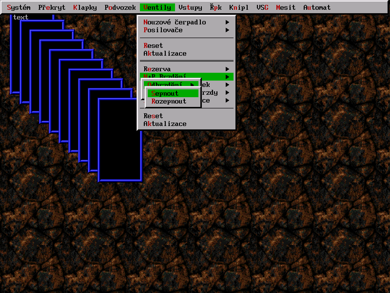
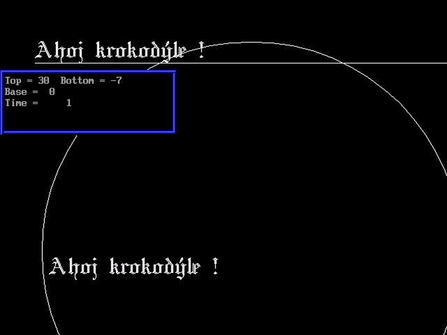

## Nostalgická sbírka různých funkcí a tříd vytvořených pro Turbo Pascal 6 někdy kolem roku 2000

Momentálně obsahuje především komponentu MyVesa, která slouží k vykreslování grafiky na SVGA.

### Screenshots

Uživatelské rozhraní využívající MyVesa ([zdrojový kód](MYVESA2/DEMO.PAS))

Různé grafické prvky vykreslené pomocí MyVesa ([zdrojový kód](MYVESA2/VESAFNT.PAS))
)
