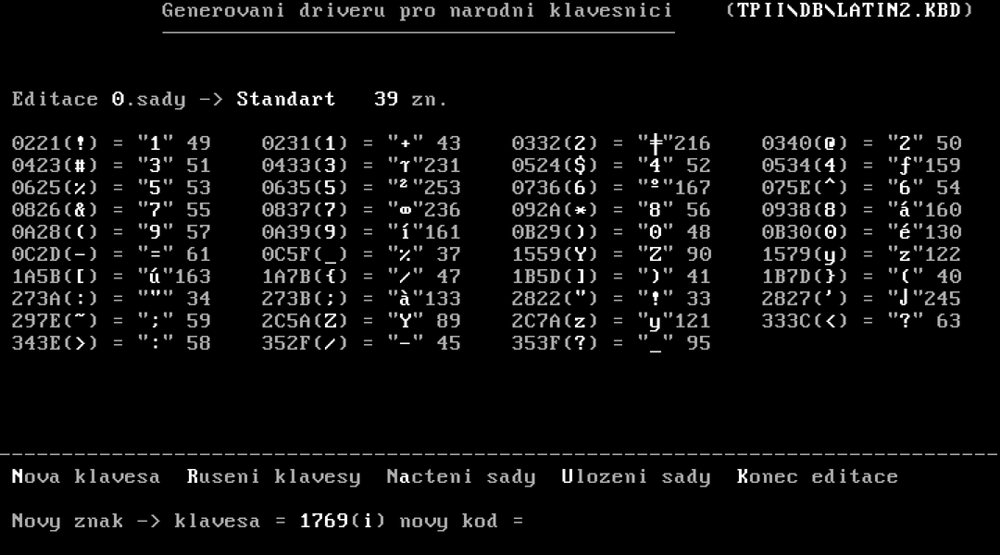

## Nostalgická sbírka různých funkcí a tříd vytvořených pro Turbo Pascal 6 někdy kolem roku 2000

### MBOOT - umožňuje vybrat diskovou oblast, ze které bude zaváděn systém

Nabídka systémů ke startu ([zdrojový kód](MBOOT/BOOT.ASS)) (dosbox sice vypisuje že startuje z A:, ale program se pochopitelně instaloval na první pevný disk)

### MKFONT16 - editor fontů 8x16 bodů ([zdrojový kód](PROGRAMY/MKFONT16.PAS))

### MKKBD - editor národních klávesnic ([zdrojový kód](PROGRAMY/MKKBD.PAS)) pro program XCHGKBD ([zdrojový kód](PROGRAMY/XCHGKBD.PAS))

### MKSORT - editor tabulek pro národní řazení nebo převody znakových sad ([zdrojový kód](PROGRAMY/MKSORT.PAS))
 

### Komponenta MyVesa, která slouží k vykreslování grafiky na SVGA.

Uživatelské rozhraní využívající MyVesa ([zdrojový kód](MYVESA2/DEMO.PAS))

Různé grafické prvky vykreslené pomocí MyVesa ([zdrojový kód](MYVESA2/VESAFNT.PAS))
)

### Simulátor interpretu basicu na osmibitovém počítači SAPI

Zajímavostí počítače SAPI bylo, že s klávesnicí komunikoval paralelním portem a s tiskárnou sériovým... takže emulátor mohl paralelním portem PC poslat příkaz `LIST` a na RS232 přečíst výpis programu a když potřeboval nahrát program do SAPI, prostě program "vytiskl" a SAPI jej dostalo jako z klávesnice.

Základní rozvržení po načtení programu ([zdrojový kód](SAPI/SAPI.PAS))

